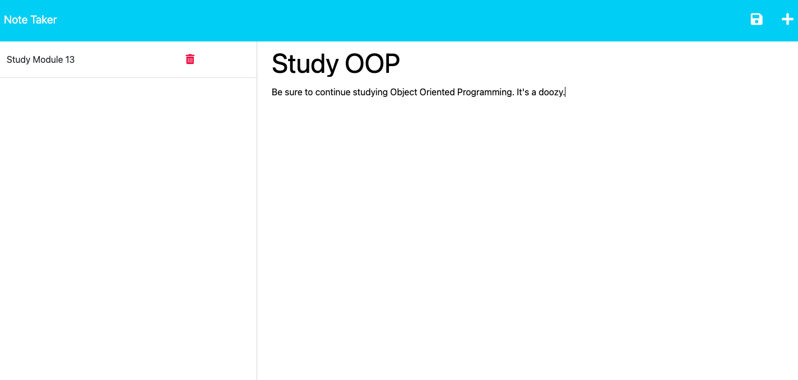

# NERDY-NOTES

A note saver powered by:

- express
- uuid
- Heroku

[This is an external link to the 'Nerdy Notes' repository](https://github.com/rhodemc/nerdy-notes)

[This is an external link to the deployed 'Nerdy Notes' site](https://nerdy-notes.herokuapp.com/)

## Description

I was motivated to create a note saver because it is a quick and efficient way to take notes.

When using Nerdy Notes, you'll find a responsive notes input that saves until deleted.

Future updates will include a better UI.

## Installation

N/A

## Usage and Testing

Once navigated to the deployed site, you will find saved notes on the left and a form to create a new note on the right. Please enter a title for your note as well as details. Once you have entered your note, click the save icon in the top right corner. Your note will be saved and appear on the left. To delete a note, click the trash icon next to the note you wish to delete.

## Credits

Nerdy Notes was built with starter coded provided by Xandromus and the University of Oregon Coding Bootcamp.

[This is an external link to the stater code repository](https://github.com/coding-boot-camp/miniature-eureka)

## License

This project is licensed by MIT. Please refer to the documentation in the repo.
